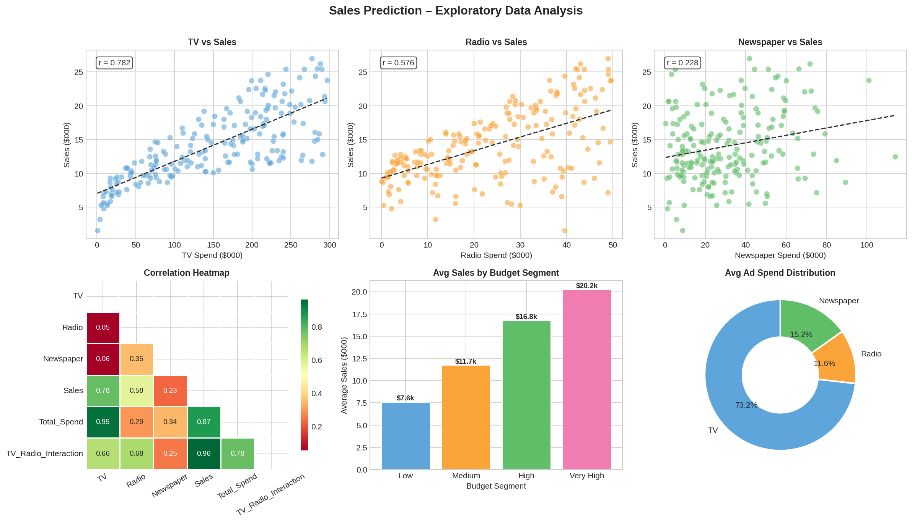
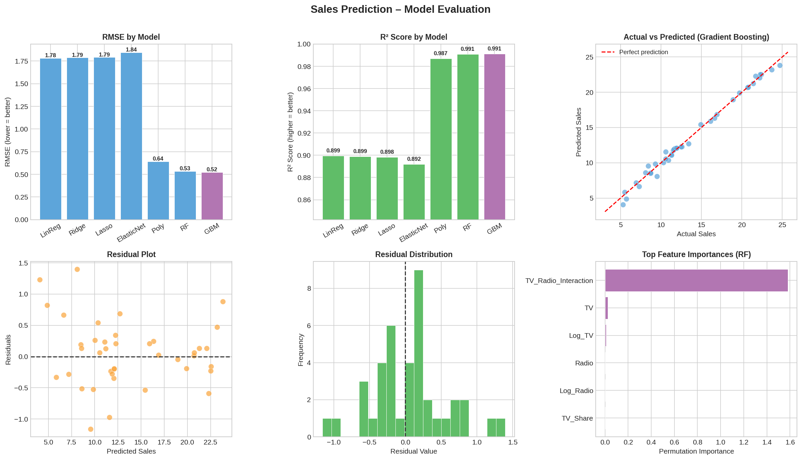
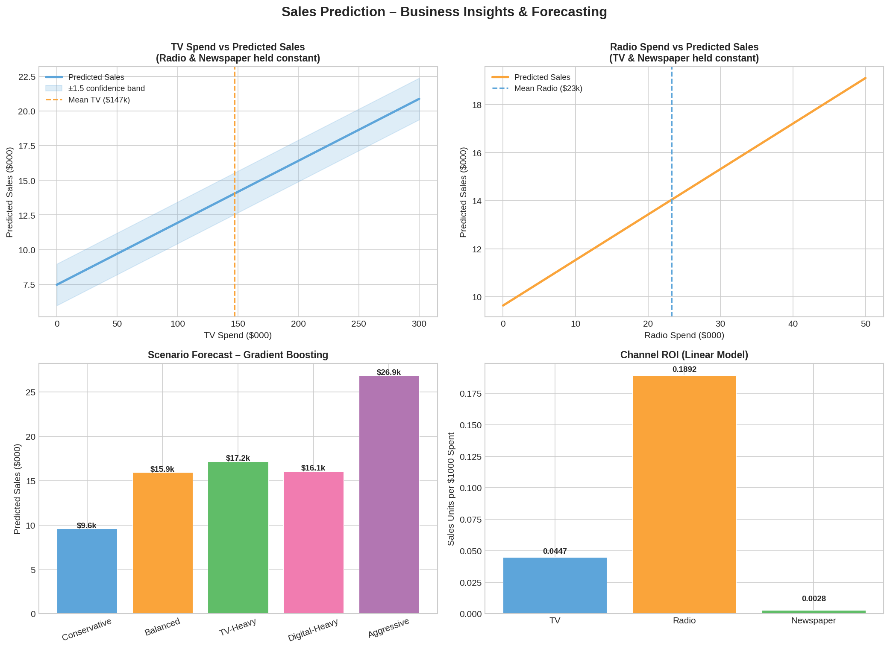

# Sales Prediction using Advertising Data

A complete machine learning pipeline that predicts product sales from TV, Radio, and Newspaper advertising spend — with scenario forecasting and actionable marketing insights.

---

## Results at a Glance

| Model | RMSE | MAE | R² |
|---|---|---|---|
| **Gradient Boosting** | **0.523** | **0.396** | **0.9913** |
| Random Forest | 0.533 | 0.424 | 0.9910 |
| Polynomial Regression | 0.643 | 0.526 | 0.9869 |
| Linear Regression | 1.782 | 1.461 | 0.8994 |
| Ridge Regression | 1.787 | 1.464 | 0.8988 |
| Lasso Regression | 1.791 | 1.461 | 0.8983 |
| ElasticNet | 1.845 | 1.507 | 0.8921 |

> **Best model:** Gradient Boosting — R² = 0.9913, RMSE = 0.523

---

## Visualisations

### Exploratory Data Analysis


### Model Evaluation


### Business Insights & Forecasting


---

## Dataset

The [Advertising dataset](https://www.kaggle.com/datasets/bumba5341/advertisingcsv) contains **200 observations** with ad spend (in $000s) across three channels and resulting sales figures.

| Column | Description |
|---|---|
| `TV` | TV advertising spend ($000) |
| `Radio` | Radio advertising spend ($000) |
| `Newspaper` | Newspaper advertising spend ($000) |
| `Sales` | Product sales ($000) — **target variable** |

---

## Project Structure

```
sales-prediction/
├── Advertising.csv            # Dataset
├── sales_prediction.py        # Full ML pipeline
├── eda_analysis.png           # EDA charts
├── model_evaluation.png       # Model comparison & residuals
├── business_insights.png      # Scenario forecasts & ROI
├── requirements.txt
└── README.md
```

---

## Setup & Run

```bash
git clone https://github.com/<your-username>/sales-prediction.git
cd sales-prediction

pip install -r requirements.txt

python sales_prediction.py
```

---

## Key Business Insights

1. **Radio has the highest ROI** — each $1,000 in Radio spend yields ~0.19 additional sales units vs ~0.04 for TV.
2. **TV × Radio interaction is the strongest predictor** — combining both channels amplifies results non-linearly (permutation importance = 1.58).
3. **Newspaper spend shows near-zero ROI** (0.0028) — budget reallocation to TV or Radio is recommended.
4. **Aggressive scenario forecast** (TV $300k + Radio $50k) → **$26.87k predicted sales**.
5. **High-budget segments** (>$300k total) average significantly higher sales — scaling spend has compounding returns.

---

## Pipeline Overview

```
Raw CSV
  └─ Data cleaning & exploration
       └─ Feature engineering
            ├─ TV×Radio interaction term
            ├─ Channel spend share ratios
            ├─ Log-transformed features
            └─ Budget segmentation
                 └─ Train / Test split (80 / 20)
                      └─ StandardScaler
                           └─ 7 models trained & compared
                                └─ Best model → scenario forecasting
```

## Tech Stack

- **Python 3.x**
- **Scikit-learn** — regression models, cross-validation, feature importance
- **Pandas / NumPy** — data wrangling & feature engineering
- **Matplotlib / Seaborn** — visualisations
